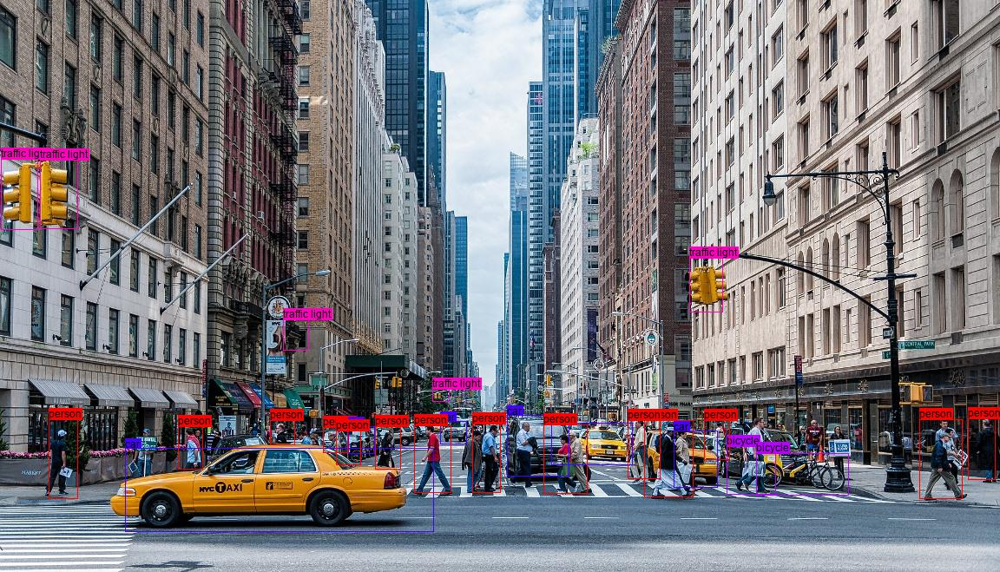
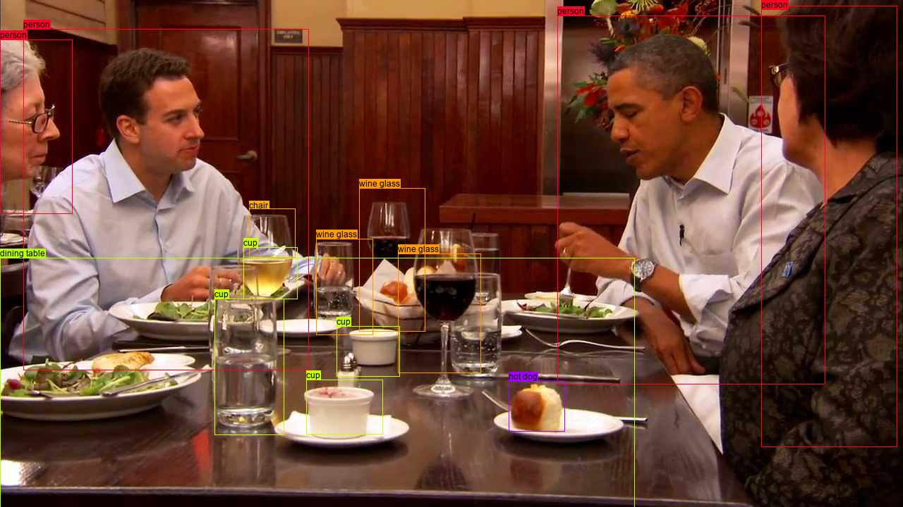
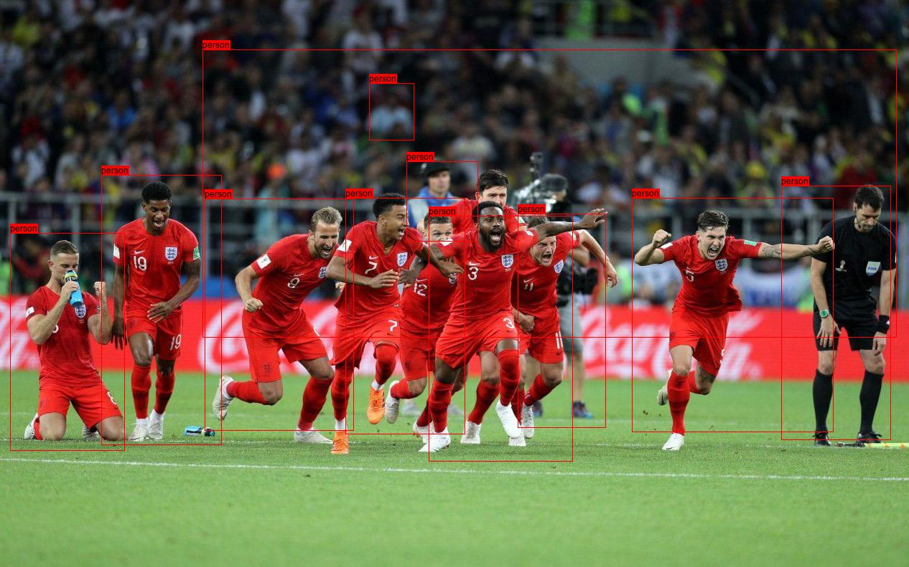

### This implementation  is not 100% same with the original version !

### The diffrence between this repo and the original [YOLOv3][paperlink]:
[paperlink]: https://pjreddie.com/media/files/papers/YOLOv3.pdf
1. Using Resnet50 as detection backbone instead of Darknet53.
2. Switch the individual binary classifier with softmax cross-entropy loss

### Things that have been done:
1. Full pytorch and numpy implementation of YOLOv3 training and detection
2. Pytorch 0.4 codes
2. Multi-Scale Training mentioned in the paper
-> so far as I noticed, this one is not implemented by a lot of posts about yolo out there.
5. lots of data augmentation,thanks to [imgaug][iaglink]:
3. training in coco2017 dataset


### How to use
First, clone this repo by input:
```
git clone https://github.com/TreB1eN/Yolov3-in-Pytorch.git
```
#### Detection:
1. Secondly, download the trained model from cloud drive into data/model folder

    - Google Drive:
        - [Cuda Model download][cuda model google link]:
        - [CPU Model download][cpu model google link]:

    - Baidu Netdisk:
        - [Cuda Model download][cuda model baidu link]:
        - [CPU Model download][cpu model baidu link]:

2. For detection in single image, please run
```
python detect_on_image.py -f input_image_path -o output_image_path -l detection_level
```
3. For detection in video, please run
```
python detect_on_video.py -f input_video_path -o output_video_path -l detection_level
```
4. For detection in camera, please run
```
python detect_on_camera.py -l detection_level
```
- - -
#### Training:
1. download train2017.zip, val2017.zip and annotations_trainval2017.zip from [coco website][coco_address] to data/coco2017
2. ```
    unzip data/coco2017/train2017.zip
    unzip data/coco2017/val2017.zip
    unzip data/coco2017/annotations_trainval2017.zip
    ```
3. run
    ```
    python train.py
    ```
    Details and parameters are in the codes

[cuda model google link]: https://drive.google.com/open?id=1VuA2SIUYat6bE6-8hvdGLCy1sDrmwK7z
[cpu model google link]: https://drive.google.com/open?id=1xN-8gRId8JfW0dgotBtueOUqCKZfj0UF
[cuda model baidu link]: https://pan.baidu.com/s/1H0gBY_CsRXmyxaV5_zpbWQ
[cpu model baidu link]: https://pan.baidu.com/s/1ZpxY4Ld-G-wfemc6OD8GEg
[coco_address]: http://cocodataset.org/#download
[iaglink]: https://github.com/aleju/imgaug

### Video Demo
Demo1
[Youtube][ytb_link1]: , [Youku][yk_link1]:
Demo2
[Youtube][ytb_link2]: , [Youku][yk_link2]:
[ytb_link1]:https://youtu.be/GZiUX4gczOc
[yk_link1]:https://v.youku.com/v_show/id_XMzcxMTQ0OTI3Ng==.html?spm=a2hzp.8244740.0.0
[ytb_link2]:https://youtu.be/C61NDUsA78k
[yk_link2]:https://v.youku.com/v_show/id_XMzcxMTY4MTUzMg==.html?spm=a2h3j.8428770.3416059.1

### Detection Example




Todo List:
* Hyperparameters Tuning
* Multi-GPU Support
* trained with original Darknet53
* try Binary Classifier instead of Softmax as discussed in the paper
---
I dont't have much computing resource, PRs are welcomed !

#### YOLOv3: An Incremental Improvement
- [original Paper][paper]:
- [original Implementation][imple]:
- [website][web]:
This repo is also inspired by [marvis/pytorch-yolo2][v2] and [qqwweee/keras-yolo3][keras]:
[imple]: https://github.com/pjreddie/darknet
[paper]: https://arxiv.org/abs/1804.02767
[web]: https://pjreddie.com/darknet/yolo/?utm_source=next.36kr.com
[v2]: https://github.com/marvis/pytorch-yolo2
[keras]: https://github.com/qqwweee/keras-yolo3
